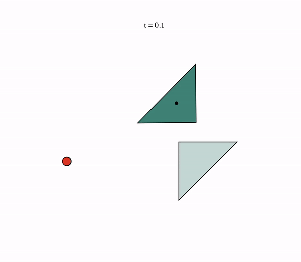
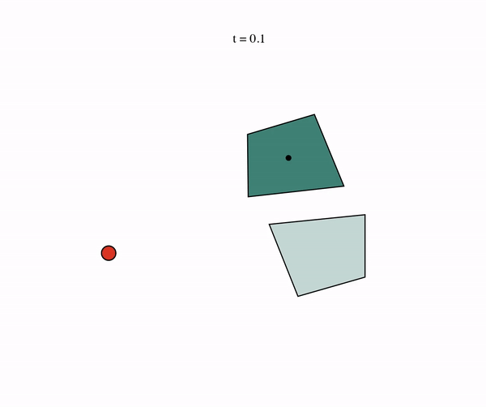
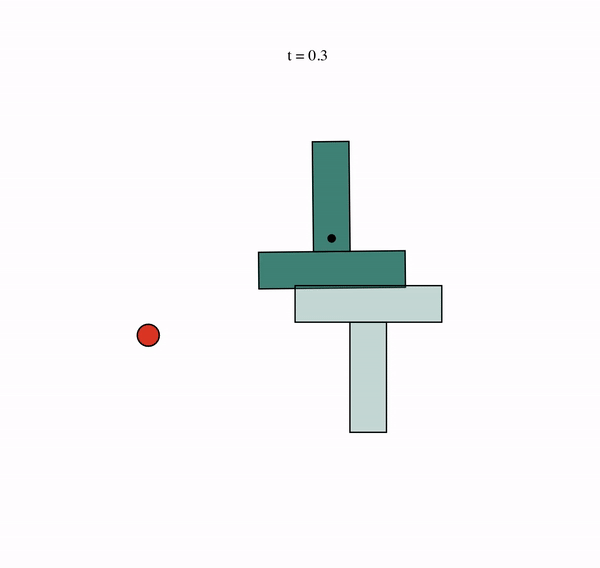
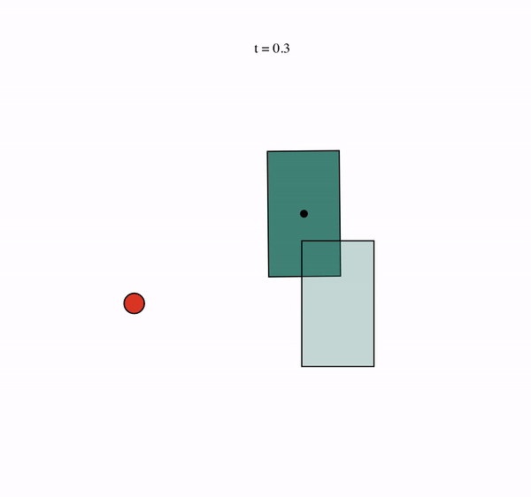

# Planning Through Contact

<p align="center">
  
  
  
</p>

## 🚀 Installation (Linux and MacOS)

This repo uses Poetry for dependency management. To setup this project, first
install [Poetry](https://python-poetry.org/docs/#installation) and, make sure
to have Python3.12 installed on your system.

Then, configure poetry to setup a virtual environment that uses Python 3.12:

```console
poetry env use python3.12
```

Next, install all the required dependencies to the virtual environment with the
following command:

```console
poetry install -vvv
```

(the `-vvv` flag adds verbose output).

For debug features to work, make sure to have graphviz installed on your computer. On MacOS, run the following
command:

```console
brew install graphviz
```

### Activating the environment

To activate the environment, run:

```console
poetry shell
```

---

## Generating planar pushing plans

Currently, the main entrypoint for generating planar pushing plans is the
following script:

```console
python scripts/planar_pushing/create_plans.py
```

which takes a number of command line arguments. Add the flag `--help` for a
description of these.

For instance, to generate 10 plans for a rectangular slider geometry, run

```console
python scripts/planar_pushing/create_plans.py --body sugar_box --seed 0 --num 10
```

which will generate plans that look like this:

<p align="center">
  
</p>

---

## RSS 2024: Towards Tight Convex Relaxations for Contact-Rich Manipulation

**🌐 Paper website**: [Towards Tight Convex Relaxations for Contact-Rich Manipulation](https://bernhardgraesdal.com/rss24-towards-tight-convex-relaxations/)

**📋 Paper**: [arXiv](https://arxiv.org/pdf/2402.10312)

📘 You can find an introduction notebook to generate planar pushing trajectories [here](https://github.com/bernhardpg/planning-through-contact/blob/introductory-notebook/notebooks/planar_pushing.ipynb).

**If you run into any problems, don't hesitate to reach out or create an issue.**

### Paper results

💻 The exact code used for generating the results in the paper can be found on the branch: [rss24-towards-tight-convex](https://github.com/bernhardpg/planning-through-contact/tree/rss24-towards-tight-convex).
The trajectories and data in the paper are generated with `scripts/planar_pushing/create_plans.py`, see the user guide below.
However, if you are simply interested in using the code, it is recommended to use the updated code on the `main` branch.

---

---

## Developers

Before merging a branch to `main`, make sure the unit test pass by running

```console
pytest
```

(after activating the virtual environment).

---

## Other (experimental)

### Running a single hardware experiment

Create a config file specifying the experiment in `config` and run it using the
following command:

```console
python scripts/planar_pushing/run_planar_pushing_experiment.py --config-name single_experiment
```

where `single_experiment` should be replaced with your config name.
